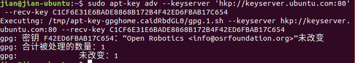
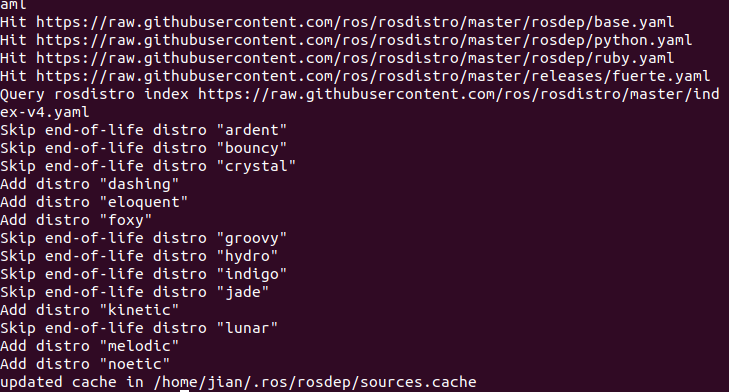
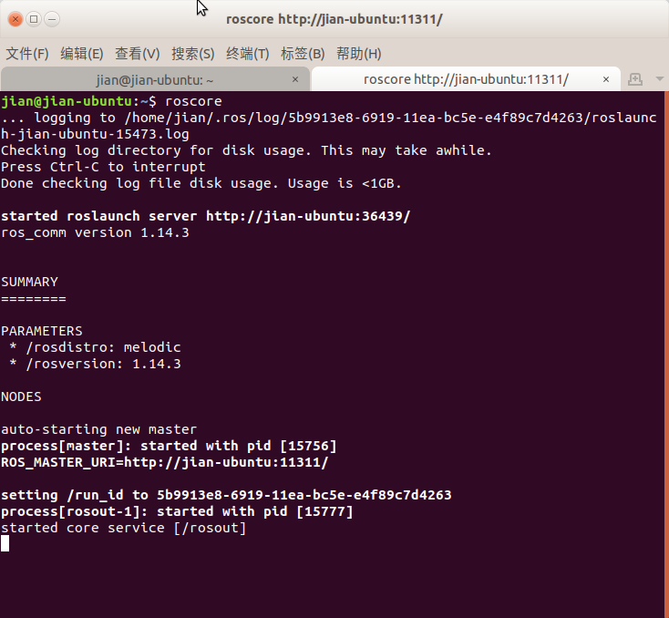
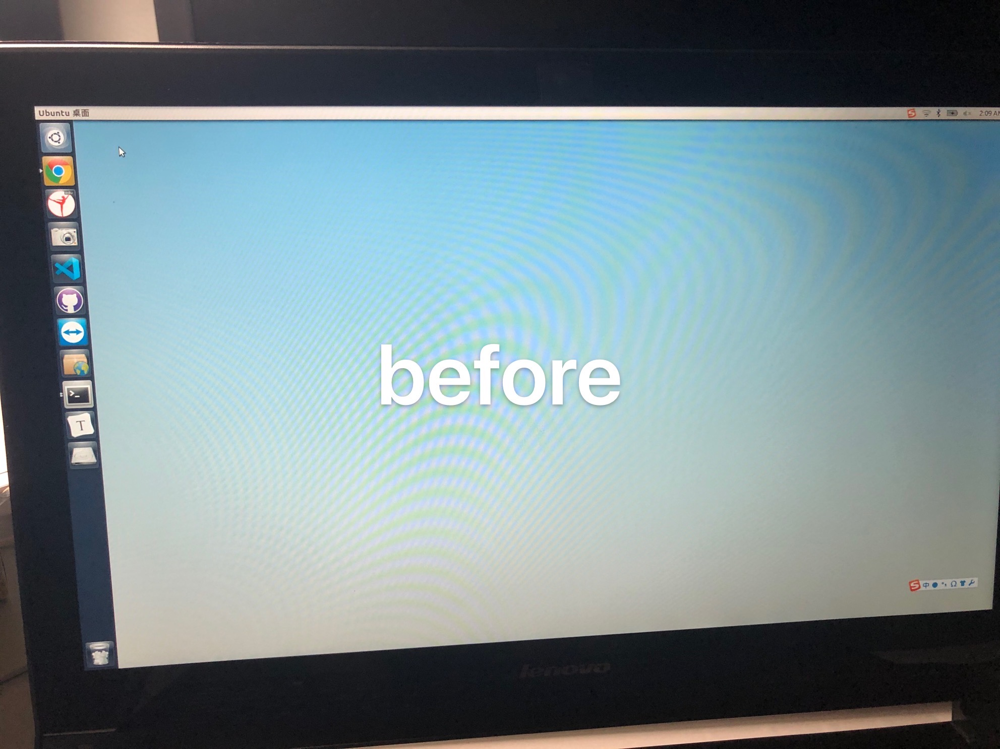
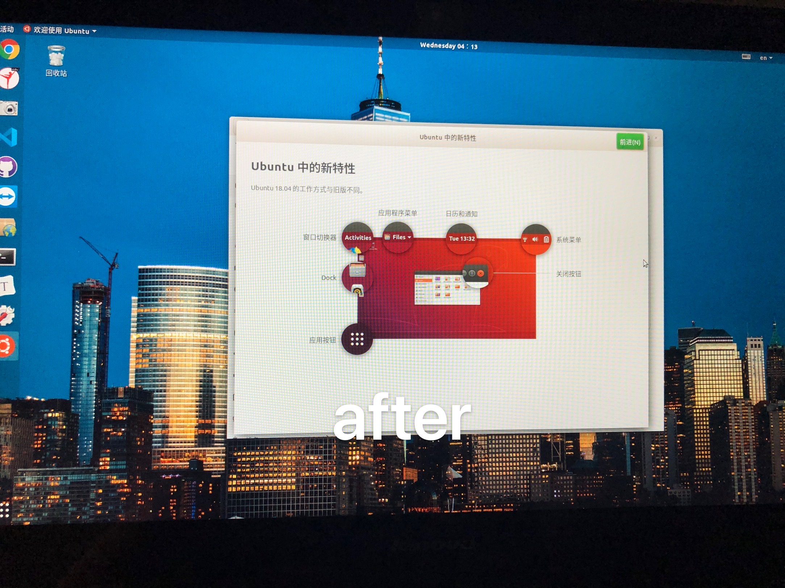

# ROS Melodic安装记录

经过一番思想上挣扎，好几次失败终于从Ubuntu16.04+Kinetic升级到18.04+Melodic。😭️

### 1. Ubuntu respositories

打开《软件和更新》确保允许"restricted," "universe," and "multiverse" 。

### 2. 设置sources.list

```shell
sudo sh -c 'echo "deb http://packages.ros.org/ros/ubuntu $(lsb_release -sc) main" > /etc/apt/sources.list.d/ros-latest.list'
```

### 3. 设置keys

```shell
sudo apt-key adv --keyserver 'hkp://keyserver.ubuntu.com:80' --recv-key C1CF6E31E6BADE8868B172B4F42ED6FBAB17C654
```



由于之前安装过其他版本所以是这样

### 4. 安装

确保Debian软件包目录索引是最新的

```shell
sudo apt update
```

安装完整版：

```shell
sudo apt install ros-melodic-desktop-full
```

### 5. 初始化rosdep

```shell
sudo rosdep init
rosdep update
```

如果显示：sudo: rosdep：找不到命令

```shell
sudo apt update
sudo apt upgrade
sudo apt-get install python-rosdep
```




### 6. 环境设置

每次打开新terminal都要输入

```shell
echo "source /opt/ros/melodic/setup.bash" >> ~/.bashrc
```

检查是否正确

```shell
gedit ~/ .bashrc
```

最后几行


### 7.软件包的依赖关系

```shell
sudo apt-get install python-rosinstall python-rosinstall-generator python-wstool build-essential
```

### 8. 检查是否成功安装

新Terminal:

```shell
roscore
```



OK～＼（≧▽≦）／～啦啦啦

#### 尝试一下控制小乌龟

新Terminal:

```shell
rosrun turtlesim turtlesim_node
```

新Terminal:

```shell
rosrun turtlesim turtle_teleop_key
```





