#   ROS 常用命令字典

```shell
# roscore will start up a ROS Master, a ROS Parameter Server and a rosout logging node
$ roscore

# rosnode is a command-line tool for printing information about ROS Nodes.
$ rosnode list

# rospack allows you to get information about packages. 

$ rospack list

# rosrun will locate PACKAGE and try to find an executable named EXECUTABLE in the PACKAGE tree. If it finds it, it will run it with ARGS.
# Usage: rosrun [--prefix cmd] [--debug] PACKAGE EXECUTABLE [ARGS]
$ rosrun turtlesim turtlesim_node
$ rosrun turtlesim turtle_teleop_key

# record the message which published in the topic
$ rosbag record /turtle1/cmd_vel

# check what's happen in ros system
$ rosrun rqt_graph rqt_graph

# rqt_plot displays a scrolling time plot of the data published on topics
$ rosrun rqt_plot rqt_plot

# rostopic is a command-line tool for printing information about ROS Topics.
$ rostopic list

# rostopic echo shows the data published on a topic.
$ rostopic echo /turtle1/cmd_vel

# rostopic type returns the message type of any topic being published.
$ rostopic type /turtle1/cmd_vel

# rostopic pub publishes data on to a topic currently advertised.
$ rostopic pub -1 /turtle1/cmd_vel geometry_msgs/Twist -- '[2.0, 0.0, 0.0]' '[0.0, 0.0, 1.8]'

# rostopic hz reports the rate at which data is published.
$ rostopic hz /turtle1/pose

# check info of /turtlesim node
$ rosnode info /turtlesim
```

##### master

用于管理节点间的通信，ROS Master 通过RPC（Remote Procedure Call Protocol，远程过程调用）提供了登记列表和对其他计算图表的查找。没有控制器，节点将无法找到其他节点，交换消息或调用服务。
开启Master命令：roscore

##### node（节点）

节点就是一些独立编译，执行运算任务的进程。ROS利用规模可增长的方式使代码模块化：一个系统就是典型的由很多节点组成的。在这里，节点也可以被称之为“软件模块”。我们使用“节点”使得基于ROS的系统在运行的时候更加形象化：当许多节点同时运行时，可以很方便的将端对端的通讯绘制成一个图表，在这个图表中，进程就是图中的节点，而端对端的连接关系就是其中弧线连接。

运行节点，rosrun package_name node_name

查看激活节点列表，rosnode list

检索有关节点信息，rosnode info node_name

##### topics 主题

在ROS中消息以一种发布/订阅的方式传递。一个节点可以在一个给定的主题中发布消息。一个节点针对某个主题关注与订阅特定类型的数据。可能同时有多个节点发布或者订阅同一个主题的消息。总体上，发布者和订阅者不了解彼此的存在。

查看激活主题：rostopic list
订阅和打印一个主题的内容：rostopic echo /topic
显示主题相关信息： rostopic info /topic

## 创建ROS workspace

###### 启动ROS

```shell
$ roscore
```


**新窗口**

###### 创建workspace

```shell
$ mkdir -p ~/catkin_ws/src
$ cd ~/catkin_ws/
$ catkin_make
```

For Python3 最后一个指令:

```shell
$ catkin_make -DPYTHON_EXECUTABLE=/usr/bin/python3
```

###### 编译 ROS 程序

```shell
$ cd ~/catkin_ws/
$ catkin_make
#或者 $ catkin_make -DPYTHON_EXECUTABLE=/usr/bin/python3
```


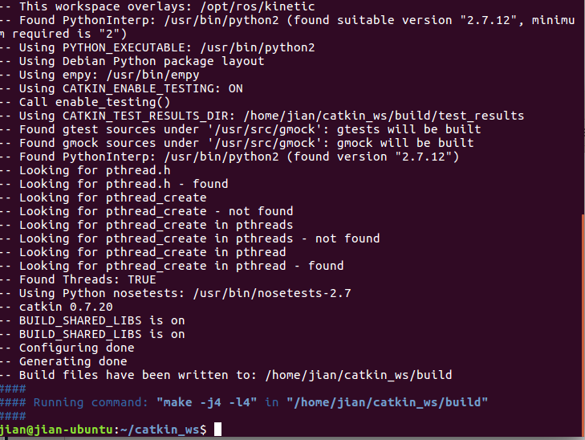

catkin_ws文件里面有三个文档：buid, devel, src。

###### 添加程序包到全局路径

```shell
$ echo "source catkin_ws/devel/setip.bash">> ~/.bashrc
$ source ~/.bashrc
```

source setup.*sh file:

```shell
$ source devel/setup.bash
```

###### 查看ros包路径环境变量是否配置好

```shell
$ echo $ROS_PACKAGE_PATH
```


## package 相关

###### 创建 Package 并编译

```shell
$ cd ~/catkin_ws/src
$ catkin_create_pkg <package_name> [depend1] [depend2] [depend3]
$ cd ~/catkin_ws
$ catkin_make
```


###### 查找 Package

```shell
$ rospack find [package name]
```


###### 查看 Package 依赖 

```shell
$ rospack depends <package_name>
$ rospack depends1 <package_name>
```

###### change directory roscd

```shell
$ roscd [locationname[/subdir]]
```


###### 列表 rosls

```shell
$ rosls [locationname[/subdir]]
```

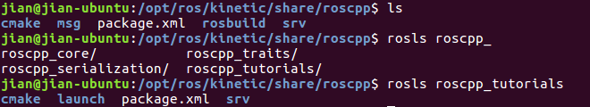

感觉和ls差不多

## Node 相关

###### 查看所有正在运行的 Node

```shell
$ rosnode list
```


###### 查看某节点信息

```shell
$ rosnode info [node_name]
```


###### 运行 Node

**新终端运行**

```shell
$ rosrun [package_name] [node_name]
```

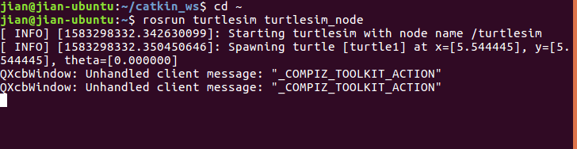


此时的rosnode list：


Ping一下:测试节点间连通性


## Topic相关

新终端：打开turtlesim

```shell
$ rosrun turtlesim turtlesim_node
```

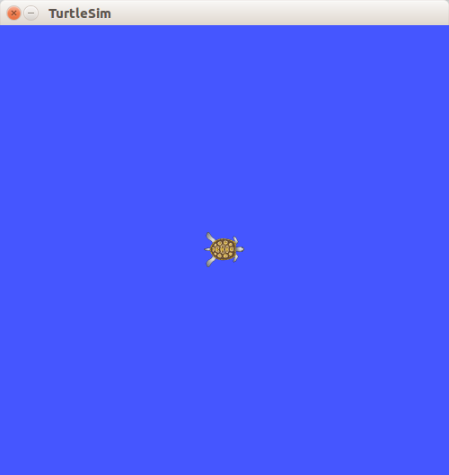

新终端:键盘控制turtlesim

```shell
$ rosrun turtlesim turtle_teleop_key
```


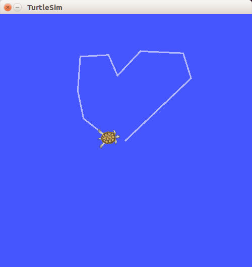

 turtlesim_node和turtle_teleop_key通过ROS topic来相互通信。turtle_teleop_key把用户按下的键发布(**publishing**)到topic上，turtlesim_node也订阅(**subscribes**)了同一个topic用来接收用户按下的键，并做出相应的动作。

###### 使用　rqt_graph 图形化显示 topic

```shell
$ rosrun rqt_graph rqt_graph
$ rosrun rqt_plot rqt_plot
```

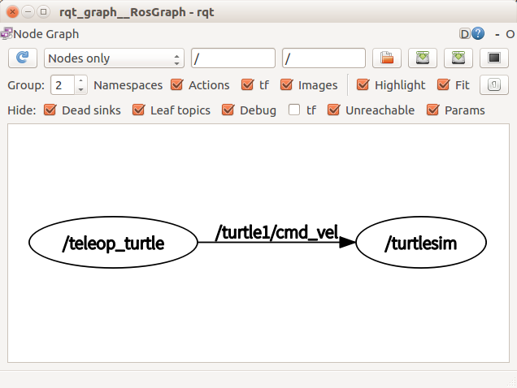

topic: /turtle1/cmd_vel

nodes: /teleop_turtle, /turtlesim

###### 查看rostopic所有操作

```shell
$ rostopic -h
```

```shell
rostopic bw     display bandwidth used by topic
rostopic echo   print messages to screen
rostopic hz     display publishing rate of topic    
rostopic list   print information about active topics
rostopic pub    publish data to topic
rostopic type   print topic type
```

###### 查看所有 Topic 列表

```shell
$ rostopic list
```

###### 查看某个 Topic 信息

```sh
$ rostopic echo [topic]
```

新终端

```shell
$ rostopic echo /turtle1/cmd_vel
```

当在**teleop_key的终端**publish new data (按方向键)，可以看到cmd_vel数据

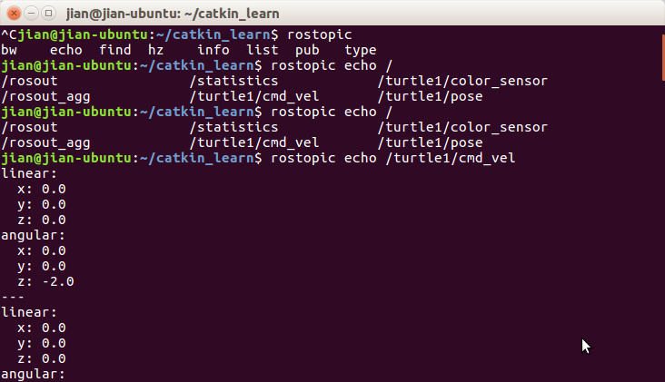

refresh rqt_graph:

可以看到 rostopic echo`　也　subscribe　turtle1/cmd_vel` topic

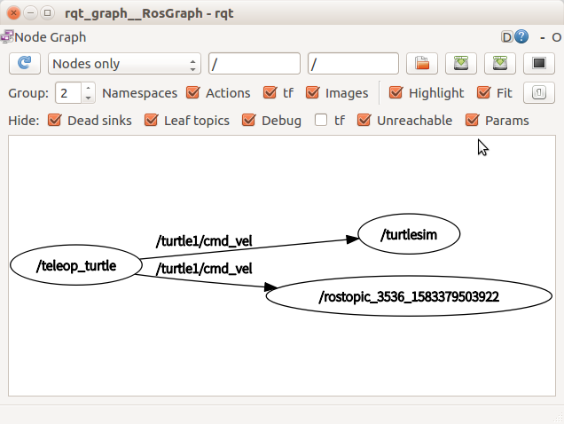

###### 查看所有 Topic 列表

```shell
$ rostopic list
```

```shell
Usage: rostopic list [/topic]

Options:
  -h, --help            show this help message and exit
  -b BAGFILE, --bag=BAGFILE
                        list topics in .bag file
  -v, --verbose         list full details about each topic
  -p                    list only publishers
  -s                    list only subscribers
```

我们的例子

```shell
jian@jian-ubuntu:~/catkin_learn$ rostopic list -v

Published topics:
 * /turtle1/color_sensor [turtlesim/Color] 1 publisher
 * /turtle1/cmd_vel [geometry_msgs/Twist] 1 publisher
 * /rosout [rosgraph_msgs/Log] 4 publishers
 * /rosout_agg [rosgraph_msgs/Log] 1 publisher
 * /turtle1/pose [turtlesim/Pose] 1 publisher

Subscribed topics:
 * /turtle1/cmd_vel [geometry_msgs/Twist] 2 subscribers
 * /rosout [rosgraph_msgs/Log] 1 subscriber
 * /statistics [rosgraph_msgs/TopicStatistics] 1 subscriber

jian@jian-ubuntu:~/catkin_learn$ 


```

###### 查看 Topic 消息格式

```shell
$ rostopic type [topic]
$ rosmsg show [msg_type]
```

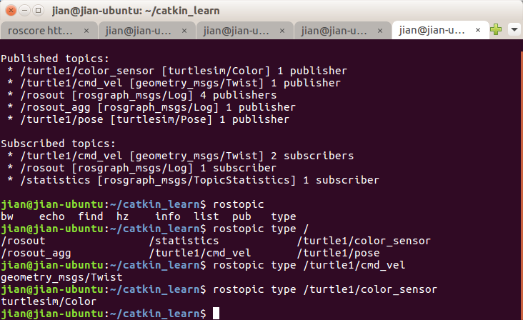

可以看出[]内的就是type, rosmsg show查看具体massage

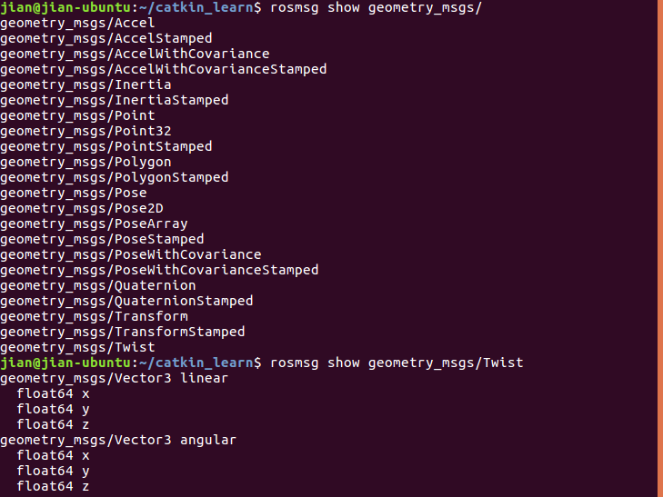

###### 向topic发布消息

```shell
$ rostopic pub [topic] [msg_type] [args]
```

例子

```shell
jian@jian-ubuntu:~/catkin_learn$ rostopic pub /turtle1/cmd_vel geometry_msgs/Twist "linear:
  x: 0.50
  y: 0.0
  z: 0.0
angular:
  x: 0.0
  y: 0.0
  z: 0.50" 
publishing and latching message. Press ctrl-C to terminate

```

ＴＡＢ调整linear & angularr参数,现在的问题是：每次运行只会publish一次，每次一部分圆弧（linear vel:1.5, angular vel:2.0）

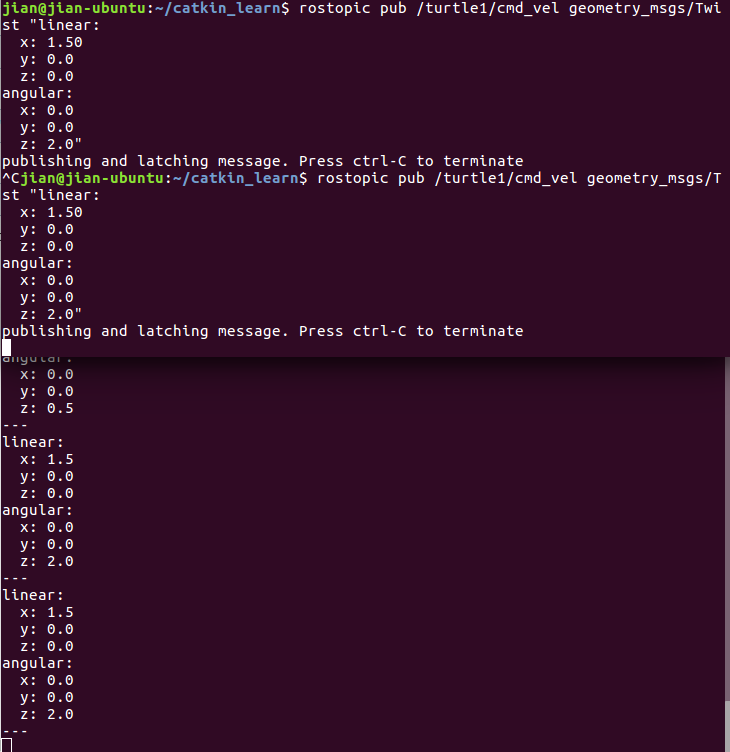


让小乌龟一直转圈：需要持续publishes the velocity commands at a rate of 1 Hz on the velocity topic: -r 1

```shell
$ rostopic pub /turtle1/cmd_vel geometry_msgs/Twist -r 1 -- '[1.5, 0.0, 0.0]' '[0.0, 0.0, 2.0]'

```

**注意：[]间有空格**,不加.0也可以

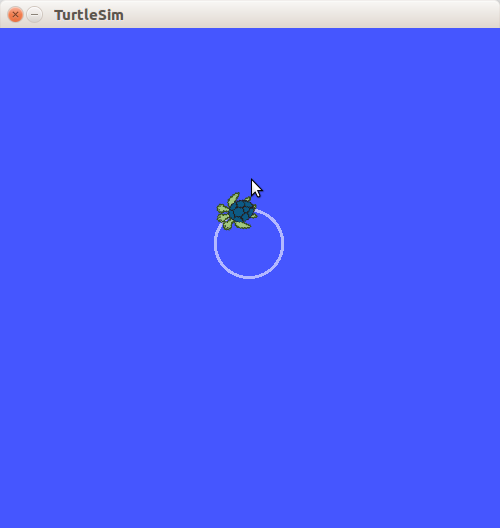

## 

[ROS/Tutorials 学到这了](http://wiki.ros.org/ROS/Tutorials/UnderstandingTopics)

