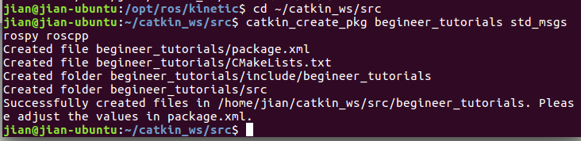
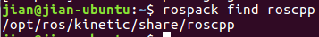
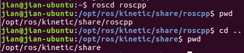
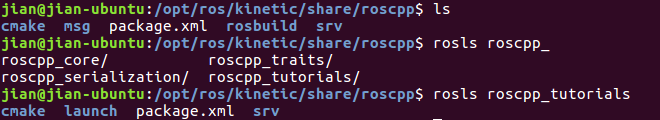
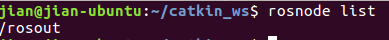
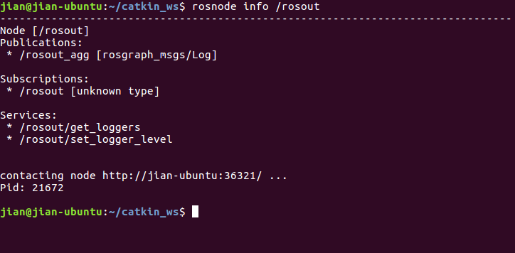
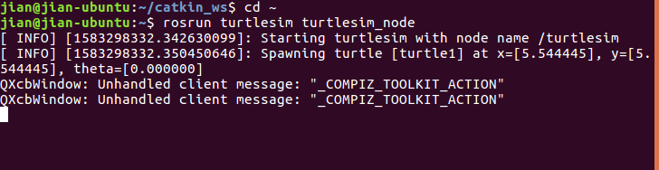
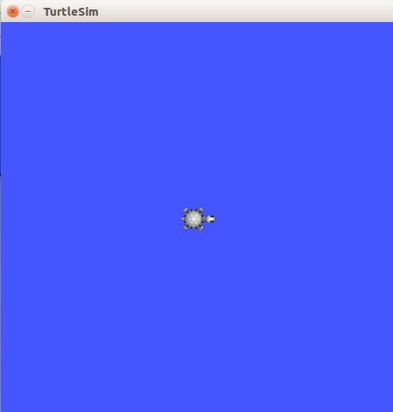
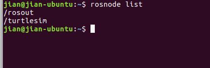
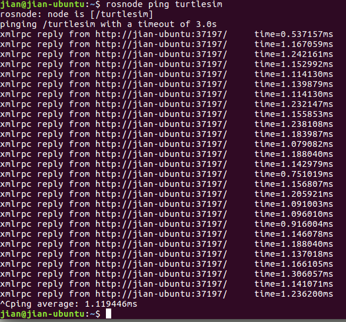

# ROS 常用命令字典

## 创建ROS workspace

启动ROS

```shell
$ roscore
```


**新窗口**


创建workspace

```shell
jian@jian-ubuntu:~$ mkdir -p ~/catkin_ws/src
jian@jian-ubuntu:~$ cd ~/catkin_ws/
jian@jian-ubuntu:~/catkin_ws$ catkin_make
```

For Python3 最后一个指令:

```shell
$ catkin_make -DPYTHON_EXECUTABLE=/usr/bin/python3
```

**参数说明**：

- -p 确保目录名称存在，不存在的就建一个。


catkin_ws文件里面有三个文档：buid, devel, src。

source setup.*sh file:

```shell
$ source devel/setup.bash
```

确保ROS_PACKAGE_PATH 在一下dictionary中

```shell
jian@jian-ubuntu:~/catkin_ws$ echo $ROS_PACKAGE_PATH
```


添加程序包到全局路径

```shell
$ echo "source catkin_ws/devel/setip.bash">> ~/.bashrc
$ source ~/.bashrc
```

## package 相关

创建 Package 并编译

```shell
$ cd ~/catkin_ws/src
$ catkin_create_pkg <package_name> [depend1] [depend2] [depend3]
$ cd ~/catkin_ws
$ catkin_make
```



查找 Package

```shell
$ rospack find [package name]
```



change directory roscd

```shell
$ roscd [locationname[/subdir]]
```


print the working directory 

```shell
$ pwd
```



列表 rosls

```shell
$ rosls [locationname[/subdir]]
```



感觉和ls差不多

**大救星Tab键**

不清楚的不打完, 按Tab键 once:会自动补全;twice:list installed packages

## Node 相关

查看所有正在运行的 Node

```shell
$ rosnode list
```



查看某节点信息

```shell
$ rosnode info [node_name]
```



运行 Node

**新终端运行**

```shell
$ rosrun [package_name] [node_name]
```





此时的rosnode list：



Ping一下



## Topic相关