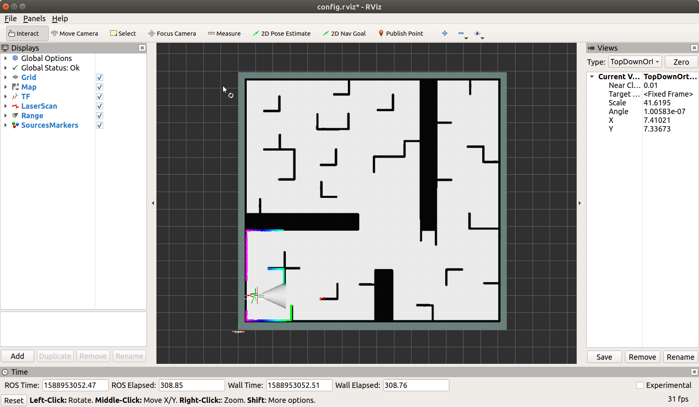

# 二维移动机器人群仿真器STDR 

STDR是Simple Two Dimentional Robot Simulator的缩写，它可以非常容易的对在二维平面移动的机器人进行仿真，STDR的设计目的不是为了像Gazebo那样的大型逼真的机器人仿真或者一个功能最全面、功能强大的仿真器，这款软件的目的是为了尽可能的简单的去模拟单个移动机器人的运动或者多个机器人的协同仿真。而且STDR不仅可以运行在一个有图形界面的环境中，还可以运行在一个无桌面环境的系统中，这样我们就可以在终端中使用ssh连接后就可以进行仿真任务了。

STDR可以完美的与ROS兼容配套，机器人上的传感器数据都是通过ros话题的形式发布。跟ROS运行一样，STDR的运行也可以将图形用户接口和服务器分开在不同的电脑上运行，而且STDR也可以和Rviz一起工作，在Rviz中将STDR中的机器人数据可视化显示。


官方网页：

[http://wiki.ros.org/stdr_simulator](https://www.corvin.cn/go?url=http://wiki.ros.org/stdr_simulator)

## 安装

方法一：失败

```shell
sudo apt-get install ros-$ROS_DISTRO-stdr-simulator
```

方法二：源码

```shell
cd <your_catkin_ws>/src
git clone https://github.com/stdr-simulator-ros-pkg/stdr_simulator.git
cd ..
rosdep install --from-paths src --ignore-src --rosdistro $ROS_DISTRO
catkin_make

# after a successful build
source <your_catkin_ws>/devel/setup.bash
```


```shell
cd <your_catkin_ws>/src
git clone https://github.com/stdr-simulator-ros-pkg/stdr_simulator.git
cd stdr_simulator/
git branch -av
cd ../..
catkin_make

# after a successful build
source <your_catkin_ws>/devel/setup.bash
```


安装完成


success后需要source devel/setup.bash这样就能保证在命令行中直接找到该仿真软件包了,通过使用下图中命令来操作来验证,只有出现下图所示的输出stdr的各项操作才能正常进行:

```shell
rospack list|grep stdr
```


## STDR代码架构介绍


## 启动STDR进行仿真

```shell
roslaunch stdr_launchers server_with_map_and_gui_plus_robot.launch
```

即可启动，会自动弹出如下的窗口


启动后在地图的左下角会自动的生成一个机器人，其中红色的线是雷达的扫描输出，绿色的部分是超声波的输出。

~~我们同样可以在rviz中显示该仿真环境，使用如下命令：~~不行！！

```
roslaunch stdr_launchers rviz.launch
```

解决方法：打开rviz，

```shell
rviz 
```

从

`/home/jian/catkin_ws/src/stdr_simulator/stdr_launchers/rviz`打开config.rviz



查看下当前的话题输出和服务列表，分别使用rostopic list命令和rosservice list命令即可


话题和节点之间的关系图通过rqt_graph命令来查看，如下图所示：


## 控制机器人移动

1. 直接往控制其移动的/robot0/cmd_vel话题中发送消息

   

   ```shell
   rostopic info /robot0/cmd vel
   ```

   顺时针旋转

   ```shell
   rostopic pub -r 2 /robot0/cmd_vel geometry_msgs/Twist '{linear: {x: 0, y: 0, z: 0}, angular: {x: 0, y: 0, z: -0.5}}'
   ```

   `-r 2`:频率2Hz发一次 or 500ms发一次信号，不加也会一直动

   

   

2. 使用teleop_twist_keyboard软件包来键盘遥控仿真机器人四处移动

   

   

   修改py文件


注意：添加别的机器人，上面还要变成相同名字才行

还需要先进入工作空间的根目录运行catkin_make来编译该软件包，然后使用source devel/setup.bash配置环境变量使该软件包可以被搜索到

```shell
jian@jian-ubuntu:~/catkin_ws/src/stdr_simulator$ cd
jian@jian-ubuntu:~$ cd ~/catkin_ws/src/stdr_simulator
jian@jian-ubuntu:~/catkin_ws/src/stdr_simulator$ cd ..
jian@jian-ubuntu:~/catkin_ws/src$ clear
jian@jian-ubuntu:~/catkin_ws/src$ git clone https://github.com/ros-teleop/teleop_twist_keyboard.git
正克隆到 'teleop_twist_keyboard'...
remote: Enumerating objects: 84, done.
remote: Total 84 (delta 0), reused 0 (delta 0), pack-reused 84
展开对象中: 100% (84/84), 完成.
jian@jian-ubuntu:~/catkin_ws/src$ ^C
jian@jian-ubuntu:~/catkin_ws/src$ cd teleop_twist_keyboard/
jian@jian-ubuntu:~/catkin_ws/src/teleop_twist_keyboard$ ls
CHANGELOG.rst   package.xml  teleop_twist_keyboard.py
CMakeLists.txt  README.md
jian@jian-ubuntu:~/catkin_ws/src/teleop_twist_keyboard$ cd ../..
jian@jian-ubuntu:~/catkin_ws$ catkin_make

#success后
jian@jian-ubuntu:~/catkin_ws$ source devel/setup.bash

```

```shell
jian@jian-ubuntu:~/catkin_ws$ source devel/setup.bash
jian@jian-ubuntu:~/catkin_ws$ clear

jian@jian-ubuntu:~/catkin_ws$ rosrun teleop_twist_keyboard teleop_twist_keyboard.py

Reading from the keyboard  and Publishing to Twist!
---------------------------
Moving around:
   u    i    o
   j    k    l
   m    ,    .

For Holonomic mode (strafing), hold down the shift key:
---------------------------
   U    I    O
   J    K    L
   M    <    >

t : up (+z)
b : down (-z)

anything else : stop

q/z : increase/decrease max speeds by 10%
w/x : increase/decrease only linear speed by 10%
e/c : increase/decrease only angular speed by 10%

CTRL-C to quit

currently:	speed 0.5	turn 1.0 
currently:	speed 0.55	turn 1.1 
currently:	speed 0.605	turn 1.21 
currently:	speed 0.6655	turn 1.21 
currently:	speed 0.73205	turn 1.21 
currently:	speed 0.73205	turn 1.331 
currently:	speed 0.73205	turn 1.1979 
currently:	speed 0.658845	turn 1.1979 
currently:	speed 0.5929605	turn 1.07811 
currently:	speed 0.53366445	turn 0.970299 
currently:	speed 0.53366445	turn 0.8732691 
currently:	speed 0.53366445	turn 0.78594219 
currently:	speed 0.53366445	turn 0.707347971 
currently:	speed 0.53366445	turn 0.6366131739 
currently:	speed 0.53366445	turn 0.57295185651 
currently:	speed 0.53366445	turn 0.515656670859 

```

## 多个机器人

添加、删除机器人， 图中机器人型号：pandora_robot.xml


控制

```shell
-- 向robot0发送一条控制其顺时针旋转的命令：

rostopic pub -1 /robot0/cmd_vel geometry_msgs/Twist '{linear: {x: 0, y: 0, z: 0}, angular: {x: 0, y: 0, z: -0.5}}'

-- 向robot１发送一条控制其逆时针旋转命令：

rostopic pub -1 /robot１/cmd_vel geometry_msgs/Twist '{linear: {x: 0, y: 0, z: 0}, angular: {x: 0, y: 0, z: 0.5}}'
```


#### Bonus:

##### rostopic pub

`pub <topic-name> <topic-type> [data...]`

>
>
>`-l, --latch` **New in Diamondback**
>
>- Enable latch mode. Latching mode is the *default* when using command-line arguments.
>
>```
>-r RATE
>```
>
>- Enable *rate mode*. Rate mode is the *default* (10hz) when using piped or file input.
>
>```
>-1`, `--once
>```
>
>- Enable *once mode*.
>
>`-f FILE` **New in Diamondback**
>
>- Read message fields from YAML file. YAML syntax is equivalent to output of `rostopic echo`. Messages are separated using YAML document separator `---`. To use only the first message in a file, use the `--latch` option.