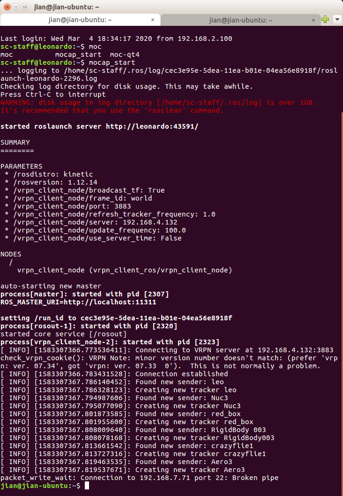
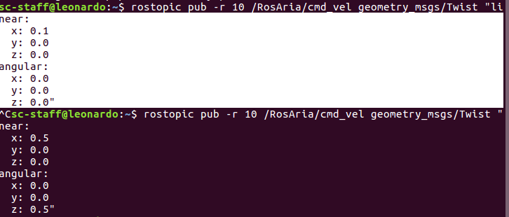
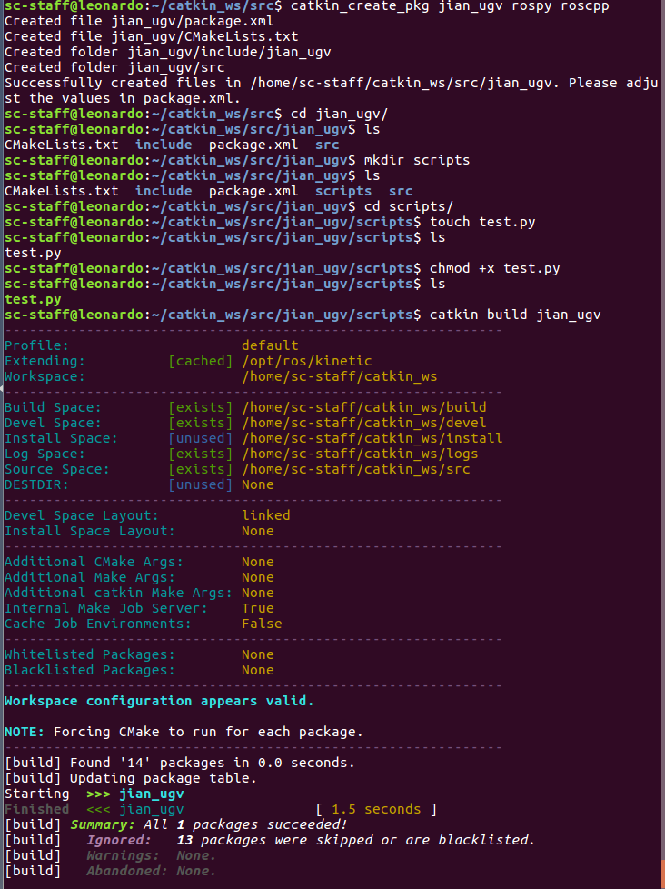
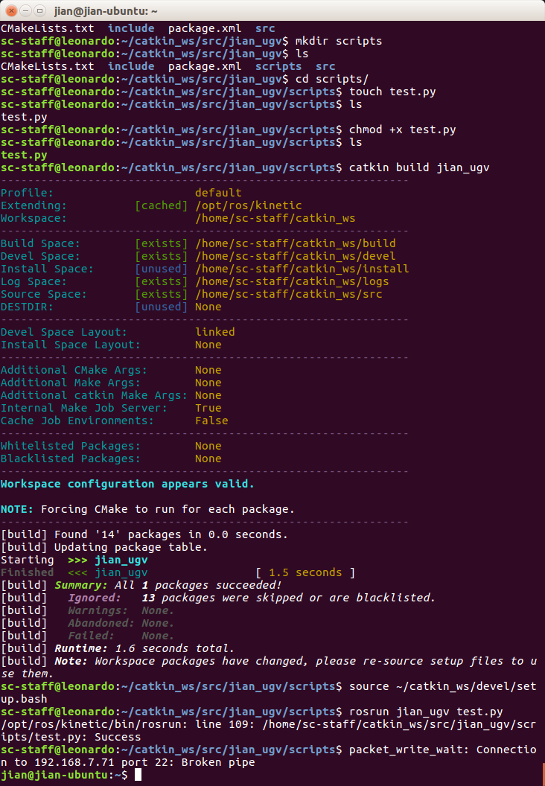

# 控制pioneer

### ssh leonardo： 192.168.7.71

```shell
jian@jian-ubuntu:~$ ssh sc-staff@leonardo

```

password: .

得到以下结果


### 新终端打开motioncapture

```shell
sc-staff@leonardo:~$ mocap_start 

```

正常显示：



### 新终端运行pioneer：

```shell
sc-staff@leonardo:~$ roslaunch pioneer bringup.launch 

```


### 直接控制机器人

```
sc-staff@leonardo:~$ rostopic pub -r 10 /RosAria/cmd_vel geometry_msgs/Twist "linear:
```




angular:

z:默认左正右负

### 直接运行 py文件

ugv.py在此路径

```shell
sc-staff@leonardo:~$ ./ugv.py 
```

### build 自己的package

```shell
sc-staff@leonardo:~/catkin_ws/src$ catkin_create_pkg <package-name> rospy roscpp
```

以后的py文件在新生成的scripts文档中保存

```shell
sc-staff@leonardo:~/catkin_ws/src$ cd <package-name>/
sc-staff@leonardo:~/catkin_ws/src/<package-name>$ ls
sc-staff@leonardo:~/catkin_ws/src/<package-name>$ mkdir scripts
sc-staff@leonardo:~/catkin_ws/src/<package-name>$ ls
```

touch <new file_name>:白色的

Linux touch命令用于修改文件或者目录的时间属性，包括存取时间和更改时间。若文件不存在，系统会建立一个新的文件

```
sc-staff@leonardo:~/catkin_ws/src/<package-name>/<new file_name>$ touch test.py
sc-staff@leonardo:~/catkin_ws/src/<package-name>/<new file_name>$ ls
test.py
sc-staff@leonardo:~/catkin_ws/src/<package-name>/<new file_name>$ chmod +x test.py 
sc-staff@leonardo:~/catkin_ws/src/<package-name>/<new file_name>$ ls
test.py
sc-staff@leonardo:~/catkin_ws/src/<package-name>/<new file_name>$ catkin build <package-name>
```



build后记得source the files

```shell
sc-staff@leonardo:~/catkin_ws/src/jian_ugv/scripts$ source ~/catkin_ws/devel/setup.bash
```



在pioneer上运行

```shell
sc-staff@leonardo:~/catkin_ws/src/jian_ugv/scripts$ rosrun jian_ugv test.py 
```

### 删除package

```shell
sc-staff@leonardo:~/catkin_ws/src$ rm -r <package-name>
sc-staff@leonardo:~/catkin_ws/src$ catkin clean <package-name>
```

### 退出

```shell
exit
```

